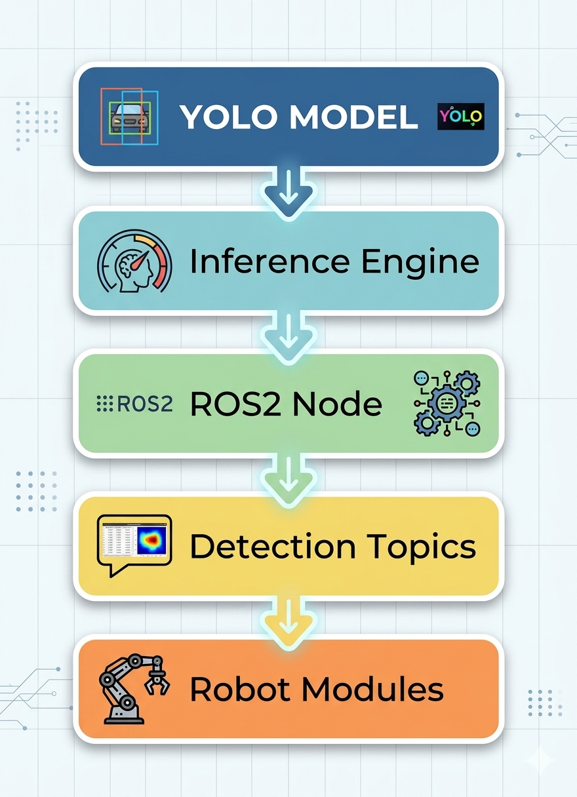
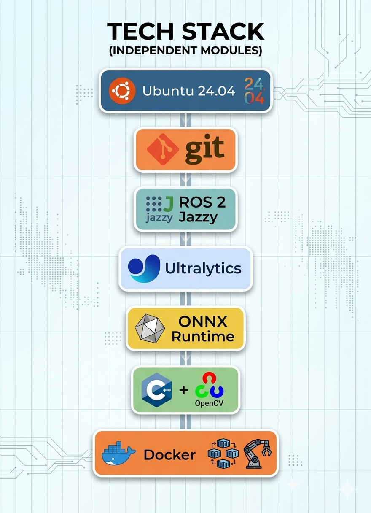

<p align="center">

# 🚀 OpenVisionABU26

</p>

<p align="center">


</p>

**OpenVisionABU26** is a real-time robotics perception system for **ABU Robocon 2026**.

It transforms a trained YOLO model into a deployable ROS 2 perception pipeline:

```
Model → Inference Engine → ROS 2 Node → Detection Topics → Robot Modules
```

---

# 🧠 System Overview

OpenVisionABU26 focuses on one core responsibility:

- detect target symbols in real time
- publish structured detection results
- support downstream robot logic
- enable stable deployment using Docker

At this stage, the system emphasizes:

```
Reliability
Modularity
Deployment readiness
```

---

# 🔄 System Workflow

## End-to-End Pipeline

<!--  -->
<p align="center">
  
</p>

The perception pipeline follows a clear robotics workflow:

```
YOLO Model
    ↓
Inference Engine
    ↓
ROS 2 Node
    ↓
Detection Topics
    ↓
Robot Modules
```

---

# ⚙️ Technology Stack

<!--  -->

<p align="center">
  
</p>

Core technologies used in this system:

## Software

- Ubuntu 24.04
- ROS 2 Jazzy
- C++
- OpenCV
- ONNX Runtime
- Docker

## Hardware

- USB camera or laptop camera
- NVIDIA GPU (recommended)

---

# ✨ Core Features

- Real-time symbol detection using YOLO
- Custom C++ inference engine
- ROS 2 Jazzy integration
- Structured detection publishing
- YAML-based configuration
- Launch file system
- Docker deployment
- Optional GPU acceleration
- Modular system architecture

---

# 📦 Deployment Modes

OpenVisionABU26 supports two primary execution modes.

---

## 🧪 Local Development

Best for rapid iteration and debugging.

```bash
cd ~/ros2_ws
colcon build
source install/setup.bash
ros2 launch abu_yolo_ros yolo.launch.py
```

---

## 🐳 Docker Deployment

Best for reproducibility and sharing.

```bash
docker build -t openvision:latest .
```

Run container:

```bash
docker run -it --rm \
  --device=/dev/video0 \
  --network host \
  openvision:latest bash
```

---

## ⚡ Optional GPU Mode

```bash
docker run -it --rm \
  --gpus all \
  --device=/dev/video0 \
  --network host \
  openvision:latest bash
```

---

# 🚀 Quick Start

## Build

```bash
docker build -t openvision:latest .
```

## Run

```bash
docker run -it --rm \
  --device=/dev/video0 \
  --network host \
  openvision:latest bash
```

Inside container:

```bash
source /opt/ros/jazzy/setup.bash
source /workspace/install/setup.bash
ros2 launch abu_yolo_ros yolo.launch.py
```

---

# 🔍 Verification

After launching the system:

```bash
ros2 topic list
ros2 topic echo /yolo/detections
ros2 topic hz /image_raw
```

Expected behavior:

- camera topic is active
- YOLO node launches successfully
- detections are published
- system runs stably

---

# 🗂 Repository Structure

```
OpenVisionABU26/
├── src/
│   └── abu_yolo_ros/
│       ├── include/
│       ├── src/
│       ├── models/
│       ├── config/
│       ├── launch/
│       ├── CMakeLists.txt
│       └── package.xml
│
├── docs/
│   └── images/
│       ├── pipeline.png
│       ├── tech_stack.png
│       └── architecture.png
│
├── docker/
├── Dockerfile
└── README.md
```

---

# 🧩 System Interfaces

## Input

```
/image_raw
```

## Outputs

```
/yolo/detections
/yolo/image_annotated
```

## Message Type

```
vision_msgs/msg/Detection2DArray
```

---

# ⚠️ Notes for Developers

Paths may differ depending on runtime environment.

Example:

```
Docker:
    /workspace/...

Local:
    /home/<user>/ros2_ws/...
```

If running locally, update model paths in:

```
config.yaml
```

---

# 📊 Current Status

OpenVisionABU26 represents:

```
Perception System v1
Stable baseline
Deployment-ready
```

Completed components:

- YOLO inference engine
- ROS 2 node
- detection publishing
- launch system
- Docker deployment
- GPU runtime support

---

# 🗺 Roadmap

## Short-term

- deployment polish
- performance benchmarking
- runtime monitoring
- documentation refinement

## Mid-term

- robot-side deployment
- edge hardware optimization
- production validation

## Future Extensions

- object grouping
- tracking
- segmentation
- distance estimation
- multi-object reasoning

---

# 🧠 Design Philosophy

> Keep the perception module focused, stable, and easy to integrate.

Rather than solving every robotics task inside one node, the system provides:

```
Clean perception output
Stable runtime behavior
Reusable interfaces
```

---

# 🎯 Intended Use

This project is intended for:

- ABU Robocon 2026
- robotics perception systems
- ROS 2 development
- deployable computer vision pipelines

---

# 🧪 Maintainer

Project:

```
OpenVisionABU26
```

Domain:

```
Robotics Perception
Computer Vision
ROS 2 Systems
```

---

# 📌 Version

```
Version: v1.0
Status: Stable perception baseline
Deployment readiness: Verified
```