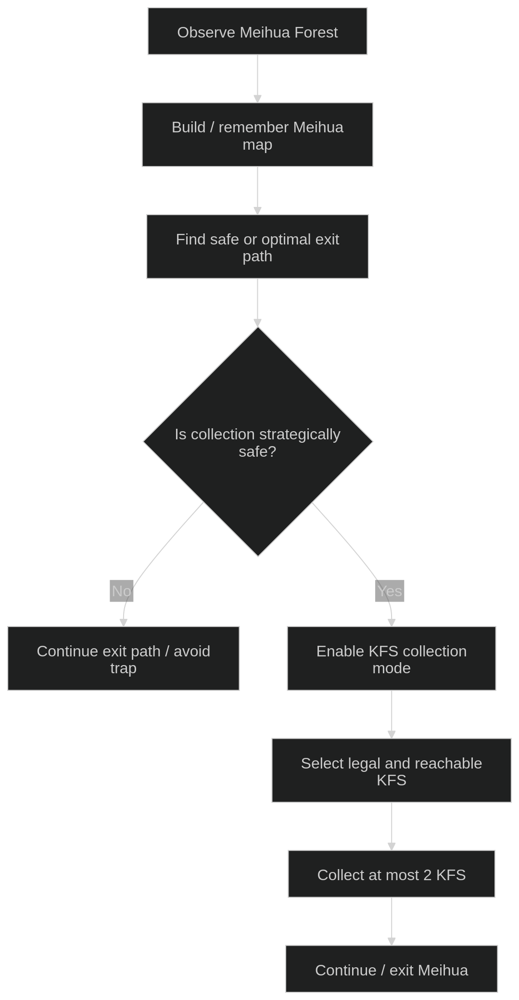

# R2 Meihua Forest Strategy Flow – Path First, Collect Later

## 1. Purpose

This note records the updated R2 Meihua Forest strategy assumption.

This strategy directly affects how OpenVision-v3 perception outputs should be consumed:

- `legal` KFS does not automatically mean "collect now"
- OpenVision-v3 provides perception evidence, not final robot action
- downstream strategy must decide whether to collect, skip, or continue path planning

## 2. Updated Strategy Summary

Core strategy:

`Path first, collect later.`

R2 should first solve or estimate the path through Meihua. KFS collection should only be enabled after the route context is understood well enough to avoid greedy mistakes.

Implications:

- legal KFS are candidates, not commands
- path safety has priority over local collection opportunity
- collection must be consistent with the overall exit plan

Current tactical constraints:

- R2 passes through Meihua once
- R2 can collect at most 2 legal KFS
- collection should not compromise the exit route

## 3. Base Flow

```text
Meihua Forest information
→ Meihua map memory
→ Safe/optimal exit path
→ Collection mode enabled
→ Select up to 2 legal KFS if strategy allows
```



## 4. Why Not Collect Immediately

Immediate collection is risky because pre-game KFS placement depends on the opponent. A legal KFS can be placed in a way that tempts R2 toward a bad block, a dead-end path, or a route that reduces later options.

The real question is not only:

- is this KFS legal?

It is also:

- can R2 still exit safely?
- is this block reachable without damaging the route plan?
- does collecting this KFS reduce future options?
- is this KFS worth taking within the 2-KFS limit?

Local legality is not the same as global strategic value. R2 should avoid greedy nearest-target behavior.

## 5. Relationship to OpenVision-v3 Outputs

Current relevant outputs:

- `/yolo/kfs_instances`
  - KFS-level 2D perception
  - legality state: `legal / illegal / unknown`
- `/yolo/kfs_instances_localized`
  - raw 3D robot-frame localization
- `/yolo/kfs_instances_stabilized`
  - smoothed robot-frame localization

OpenVision-v3 currently provides:

- KFS existence
- semantic group: `REAL / FAKE / R1 / AMBIGUOUS / UNKNOWN`
- decision: `legal / illegal / unknown`
- bbox and class names
- team color evidence
- localized position if available
- stabilized position if available

OpenVision-v3 does not decide:

- collection order
- whether to collect now
- route choice
- target priority
- whether to skip a legal KFS for path safety

## 6. Downstream Strategy Requirements

Downstream modules should eventually be responsible for:

- building or updating the Meihua block map
- associating KFS positions with MH block IDs
- marking blocks with `legal / illegal / unknown` KFS evidence
- planning a route through Meihua
- evaluating whether collecting a KFS is safe
- enforcing the maximum collection count of 2
- remembering whether R2 has already passed through Meihua
- avoiding greedy nearest-legal-KFS behavior

Important dependency:

- Closest KFS Selection should only be considered after path context exists
- KFS Target Priority Tracking should only be enabled after strategy confirms that target pursuit is useful

## 7. Strategic State Ideas

Possible future strategy states:

- `MEIHUA_OBSERVE`
- `MEIHUA_MAP_BUILD`
- `MEIHUA_PATH_PLAN`
- `MEIHUA_EXIT_PRIORITY`
- `MEIHUA_COLLECT_MODE`
- `MEIHUA_COLLECT_LIMIT_REACHED`
- `MEIHUA_DONE`

These are conceptual states only. They are not implemented in the current OpenVision-v3 perception runtime.

## 8. Collection Policy Draft

Draft downstream policy:

- only consider KFS with `decision=legal`
- ignore `illegal` as collection targets
- treat `unknown` as uncertain and requiring re-check
- never collect `AMBIGUOUS` based on one frame
- only collect after path safety is checked
- do not collect more than 2 KFS
- do not re-enter Meihua after the one planned pass
- if collecting a legal KFS threatens the exit route, skip it

## 9. Future Work

- define Meihua block map representation
- connect stabilized KFS positions to block IDs
- define route planner interface
- define legal KFS map
- design strategy-level KFS Target Priority Tracking
- design Closest KFS Selection only after path context exists
- define collection mode trigger
- integrate R2 pass count and collection count
- test trap/lure scenarios based on opponent KFS placement

## 10. Current Status

- This is a strategy design note.
- It is not implemented yet.
- It should guide downstream planning and state-machine design.
- OpenVision-v3 perception already provides the required KFS semantic and localization signals.
- Final collection strategy remains future work outside the current perception runtime.

