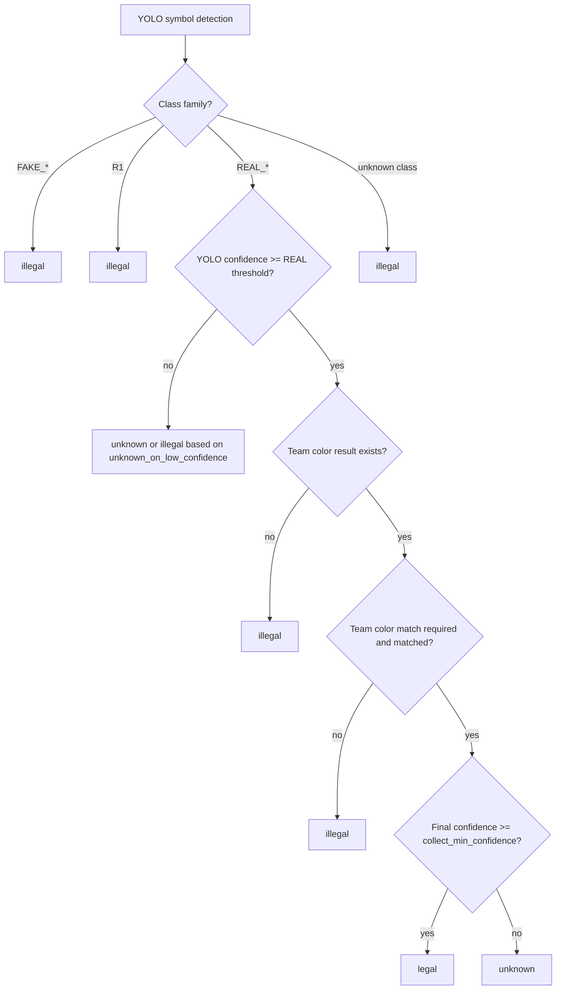
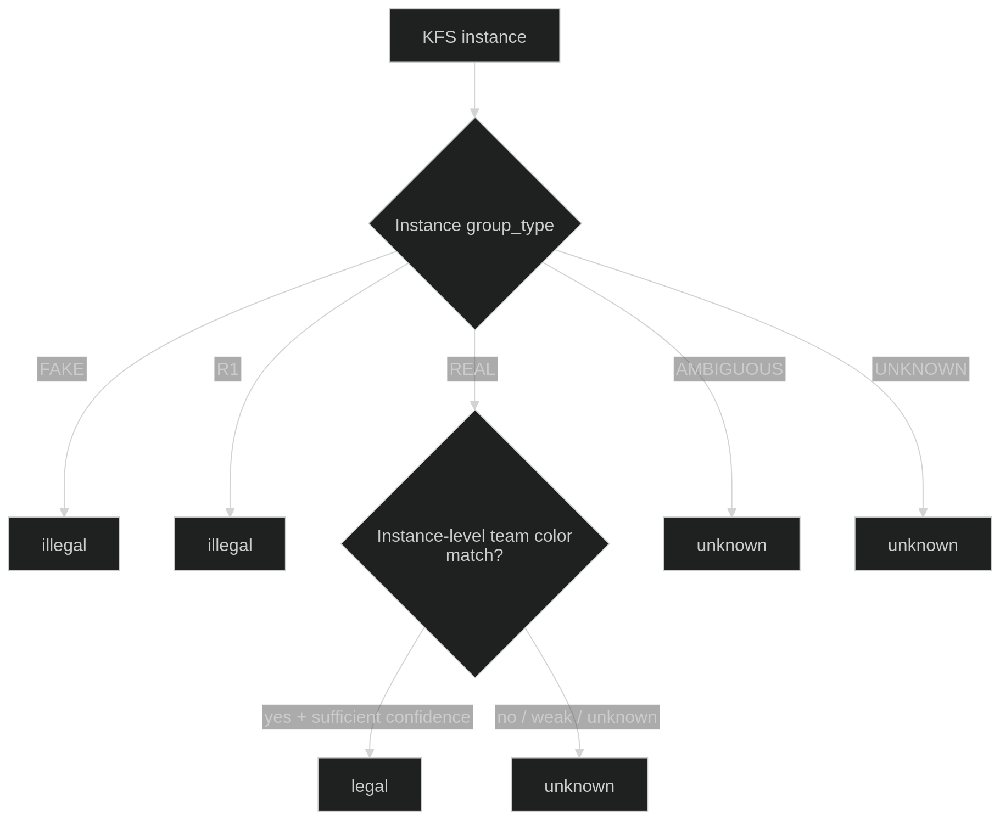
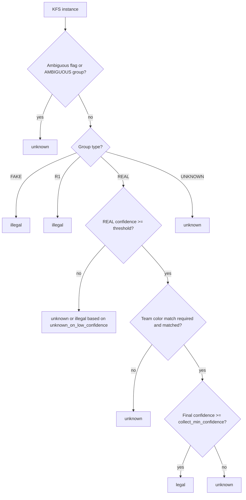

# OpenVision – DecisionEngine Groundwork

**Date:** 2026-04-24  
**Status:** Stable groundwork later evolved into OpenVision-v3 legality interpretation  
**Workspace:** `~/openvision_ros2_ws_v2`  
**Package:** `abu_yolo_ros`

## 1. Historical Objective

This milestone originally introduced the DecisionEngine module during the older v2 phase.

At that time, the goal was to:

- combine YOLO semantic class information with TeamColorFilter output
- classify detections into a higher-level interpretation layer
- keep message contracts stable while the logic was still being tuned

## 2. Important Historical Implementation Work

Initial DecisionEngine work included:

- `include/abu_yolo_ros/decision_engine.hpp`
- `src/decision_engine.cpp`
- YAML-configurable thresholds and confidence weighting
- debug logging for semantic class, color result, confidence, and reasoning
- unit tests for important rule paths

An important bug was also corrected early:

- the logic was moved away from hard-coded `class_id` assumptions
- semantic `class_name` or family became the real source of truth

That design choice still matters in OpenVision-v3.

## 3. Terminology Update

The terminology has evolved since the original v2 wording.

Older action-oriented labels:

- `collect`
- `avoid`
- `unknown`

Current OpenVision-v3 vision-level labels:

- `legal`
- `illegal`
- `unknown`

Important clarification:

- the DecisionEngine now determines KFS legality interpretation
- it does **not** directly command robot action
- collection, skipping, route choice, target persistence, and servoing are downstream strategy or control decisions

## 4. How the DecisionEngine Evolved in OpenVision-v3

The original v2 DecisionEngine was symbol-level.

OpenVision-v3 now uses DecisionEngine logic in two contexts:

- **symbol-level DecisionEngine**
  retained mainly for compatibility, logging, and low-level debug interpretation
- **instance-level DecisionEngine**
  applied after `KFSInstanceAggregator` groups symbol detections into physical KFS candidates

The instance-level stage is now the more important runtime interpretation layer.

## 5. Current OpenVision-v3 Decision Logic

Current vision-level interpretation rules are centered on legality, not direct action.

High-level current rules:

- `FAKE` -> `illegal`
- `R1` -> `illegal`
- `REAL` with strong team-color match -> `legal`
- `REAL` without strong team-color match -> `unknown`
- ambiguous or unsupported evidence -> `unknown` or dropped depending on aggregation stage

Additional clarification:

- ambiguous mixed clusters may be dropped before final publication if the aggregation stage marks them unsafe
- low-confidence or weak-color cases should prefer `unknown` rather than an unsafe forced decision

## 6. Relationship Between Aggregation and Decision

In current OpenVision-v3, legality interpretation happens after KFS aggregation becomes available.

Current conceptual flow:

Camera/Image  
-> YOLO symbol detection  
-> symbol filtering  
-> KFSInstanceAggregator  
-> instance-level TeamColorFilter  
-> instance-level DecisionEngine  
-> `/yolo/kfs_instances`

This is a major architectural change from the older v2 symbol-only logic.

## 7. Current OpenVision-v3 Status

The DecisionEngine should now be understood as a legality classifier inside the KFS-level runtime.

Current role:

- interpret semantic KFS type
- combine that interpretation with team-color evidence
- produce `legal / illegal / unknown`
- remain separate from downstream strategy modules

The runtime no longer treats `collect / avoid` as the primary vision-level contract.

## Decision Tree

### 1. Decision Tree Overview

The DecisionEngine decides KFS legality, not robot action.

- `legal` means the KFS is a valid candidate from the vision and rule perspective
- `illegal` means the KFS should not be considered a valid target candidate
- `unknown` means the evidence is insufficient, weak, or ambiguous

Downstream planning and strategy decide whether to collect, skip, route around, or prioritize a target.

### 2. Symbol-Level Decision Tree

The symbol-level DecisionEngine works from individual YOLO detections and TeamColorFilter evidence. In the current code, this path is stricter than the instance-level path and is mainly used for compatibility and debug context.

Plain-text current symbol-level logic:

- `FAKE_*` -> `illegal`
- `R1` -> `illegal`
- `REAL_*` with YOLO confidence below threshold -> `unknown` or `illegal` depending on `unknown_on_low_confidence`
- `REAL_*` with no team-color result -> `illegal`
- `REAL_*` with team-color mismatch or unknown color -> `illegal`
- `REAL_*` with correct team-color match but low final confidence -> `unknown`
- `REAL_*` with strong team-color match and enough final confidence -> `legal`
- unknown class -> `illegal`

Important note:

This stricter symbol-level behavior is what the current code implements in `classifyKFS()`. The preferred current runtime decision level is the instance-level path below.

### 3. Instance-Level Decision Tree

The instance-level DecisionEngine works after `KFSInstanceAggregator` and is the preferred current runtime decision layer for `/yolo/kfs_instances`.

Plain-text current instance-level logic:

- `FAKE` instance -> `illegal`
- `R1` instance -> `illegal`
- `REAL` instance with low confidence -> `unknown` or `illegal` depending on `unknown_on_low_confidence`
- `REAL` instance with no strong team-color match -> `unknown`
- `REAL` instance with strong team-color match and enough final confidence -> `legal`
- `AMBIGUOUS` instance -> `unknown`
- `UNKNOWN` instance -> `unknown`

Important note:

- `AMBIGUOUS` instances must not become `legal`
- if ambiguous clusters are dropped by config, they may never appear in final `/yolo/kfs_instances`
- if ambiguous dropping is disabled, they can remain visible with `ambiguous=true`, `ambiguous_reason`, and `decision=unknown`

### 4. Ambiguous Cluster Handling

Ambiguous detection and ambiguous dropping are different stages.

Current behavior from the aggregator:

- a cluster is explicitly marked ambiguous when the symbol count exceeds `max_symbols_per_instance`
- the current workspace YAML sets `kfs_instance_aggregation.max_symbols_per_instance: 3`
- the current workspace YAML sets `kfs_instance_aggregation.drop_ambiguous_clusters: false`

That means, in the current config:

- clusters with more than 3 symbols can become `AMBIGUOUS`
- those ambiguous clusters are currently kept visible rather than automatically removed
- the DecisionEngine should classify them as `unknown`, not `legal` or `illegal`

Current mixed-semantic-group behavior should be documented carefully:

- `REAL + FAKE`
- `REAL + R1`
- `FAKE + R1`

are not automatically marked `AMBIGUOUS` by a dedicated semantic-mixing rule in the current aggregator.

Current aggregator group resolution is:

- if any `R1` is present -> group becomes `R1`
- else if any `FAKE` is present -> group becomes `FAKE`
- else if all are `REAL_*` -> group becomes `REAL`
- else -> group becomes `UNKNOWN`

Potential improvement:

- mixed semantic evidence could be treated more explicitly as ambiguous in a future revision if that proves safer in real runtime data

### 5. DecisionEngine vs Strategy

DecisionEngine does **not**:

- select closest KFS
- decide collection order
- perform KFS Target Priority Tracking
- perform Visual Servoing
- command the robot to collect or avoid

DecisionEngine only:

- classifies current KFS legality from perception evidence
- provides a stable semantic signal to downstream modules

### 6. Output Fields

Where the decision appears:

- symbol logs:
  - `symbol_decision`
  - `symbol_final_conf`
  - `symbol_reason`
- KFS instance message:
  - `/yolo/kfs_instances`
  - `KfsInstance.decision`
- localized and stabilized outputs:
  - `/yolo/kfs_instances_localized`
  - `/yolo/kfs_instances_stabilized`
  - decision remains inside `source_instance.decision`

## 8. Relationship to Message Contracts

The modern runtime publishes structured KFS outputs through:

- `KfsInstance.msg`
- `KfsInstanceArray.msg`

Later milestones also added:

- `LocalizedKfsInstance.msg`
- `LocalizedKfsInstanceArray.msg`

This means the DecisionEngine is now part of a larger interpreted perception contract rather than a standalone debug-only classifier.

## 9. Relationship to Later Milestones

This groundwork later evolved into:

- `2026-04-25_04_KFSInstancePrototype.md`
- `2026-04-26_05_OpenVisionV3_KFSInstanceRuntime.md`
- `2026-04-27_06_OpenVisionV3_KFS3DLocalizer.md`
- `2026-04-27_07_OpenVisionV3_KFSLocalizationStabilizer.md`

Those later milestones moved the project from symbol-level interpretation toward:

- KFS-level instance reasoning
- legality-focused outputs
- localized and stabilized downstream contracts

## 10. Historical Notes Preserved

The following historical ideas from the v2 phase still remain valid:

- semantic labels are safer than relying on model index ordering
- thresholds should remain YAML-configurable
- debug logs are useful while tuning interpretation behavior
- low-confidence cases should default to conservative handling

What changed is not the need for a DecisionEngine, but the scope and terminology of what it now decides.

## 11. Validation History

Original validation from the groundwork phase remains relevant:

- `colcon build` passed
- semantic label handling was verified against non-linear `class_id` ordering
- threshold tuning and logic tests improved confidence before larger runtime integration

## 12. Final Interpretation

This file records the historical origin of the DecisionEngine, but the current OpenVision-v3 interpretation is:

- legality classification, not direct robot action
- symbol-level groundwork extended into instance-level KFS reasoning
- a supporting part of the larger KFS runtime pipeline rather than a standalone final decision layer
